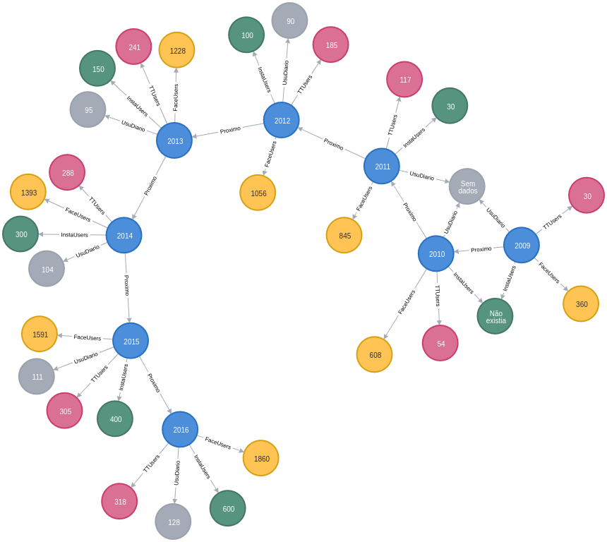
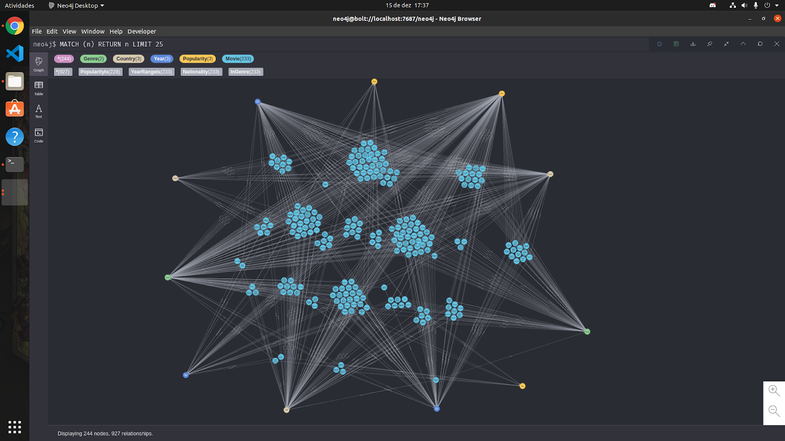
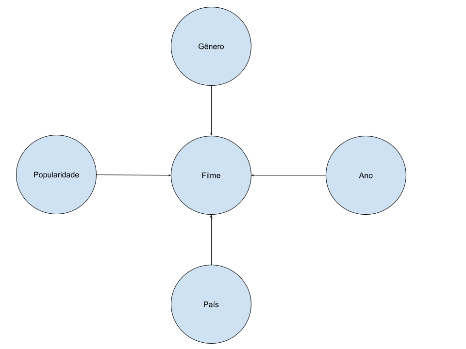

# Etapa Final

## Projeto Mídias e Consequências Psicológicas

## Equipe

- Natan Rodrigues de Oliveira
- Heigon Alafaire Soldera Pires
- Victor Rigatto

## Slides de apresentação

Os slides usados na apresentação da Etapa Final podem ser vistos [aqui](slides/HVN\ -\ Apresentação\ final.pdf).

## Resumo do projeto

De maneira resumida, inicialmente encontramos um tema motivador e importante para realizar as atividades do projeto. Essas atividades constituiram a elaboração de um primeiro modelo conceitual e a pesquisa de fontes de dados que fossem compatíveis com os temas que escolhemos, levando-se em conta os requisitos técnicos que aprendemos ao longo da disciplina, como o formato dos dados e os métodos para obtê-los.

Posteriormente, processamos e normalizamos os dados brutos obtidos das fontes selecionadas, de forma que ficassem mais compatíveis para serem relacionados com base às indagações que definimos a partir dos temas que escolhemos. Esse processo foi continuamente aprimorado conforme o desenvolvimento dos estágios e o aprendizado da matéria, pelos quais aprimoramos o modelo conceitual, nossas indagações e o processamento dos dados.

Dessa forma, então, utilizamos diferentes métodos e conhecimentos da disciplina de Bancos de Dados para relacionar os dados e entender e visualizar as nossas indagações.

## Motivação e Contexto

O tema da depressão é sempre muito importante, e tem ganhado cada vez mais espaço em debates sobre a saúde mental nos tempos atuais, uma vez que há sempre mais indícios de que os mais jovens têm sofrido mais com doenças dessa natureza do que em outras épocas.

Dessa forma, nossa indagação abrange o impacto de uma tecnologia contemporânea, as mídias digitais e redes sociais, quando o tema é a depressão e o suicído.

A partir de dados disponíveis na internet, como da OMS e CDC (EUA), podemos identificar um aumento perceptível da incidência de lesão auto infligida, por faixa etária, especialmente a partir do ano de 2009, quando ocorreu a popularização de redes sociais em dispositivos móveis. 

Indagamos, também, sobre possíveis relações das taxas de suicídio com o Efeito Werther, conhecido como o suicídio “copiado”, onde pode-se observar aumentos de taxas de suicídio após a divulgação de um suicídio em mídias, como as mencionadas anteriormente.

Assim, nos sentimos motivados a utilizar e relacionar esses dados e esses temas. Nota-se que o objetivo do projeto não é efetivamente provar as indagações aqui levantadas, mas utilizar desses temas para adquirir na teoria e na prática os conhecimentos de Bancos de Dados.

## Detalhamento do projeto

Com objetivo de construir um modelo tal que pudéssemos verificar a ocorrência de um aumento na média das taxas de suicídio em relação a lançamentos de alguns títulos no cinema, buscamos fontes de dados que conseguissem nos dar informações sobre suicídios ao longo tempo em determinados países e os lançamentos de filmes variados com suas respectivas avaliações. Tais fontes podem ser verificadas mais abaixo.

Uma destas fontes nos trouxe informações sobre diversos países e as taxas de suicídio de acordo com ano, idade, sexo, gênereo e PIB de um determinado país em uma tabela. Algumas colunas tinham muitos valores nulos e outras traziam valores repetidos que não nos serviam para este contexto. Sendo assim, foi nessessário uma normalização da tabela de acordo com a normalização BCNF. O código das normalizações feitas se encontra [neste arquivo](src/normalizacao.py).

A partir da tabela normalizada e disponibilizada em ```.csv```, identificada como [tabela de suicídios](data/raw/tabela.csv), levantamos alguns questionamentos como:

- Qual o PIB do país com maiores taxas de suicídio em 2015?
- Qual a faixa etária das pessoas que mais se suicidaram neste mesmo país?

entre outros questionamentos que fizemos. Conseguimos respondê-los com queries SQL contidas neste [notebook](notebooks/queries_sql.ipynb).

Por meio dos resultados obtidos com as queries acima, verificamos que alguns países tinham taxas exorbitantes e números muito duvidosos, mesmo após a normalização. Portanto foi necessário fazer um tratamento de dados desconsiderando as taxas acima de 100% e, consequentemente, selecionamos países como EUA, Brasil e França para a correlação feita com a fonte de dados sobre filmes.

Já para a fonte de dados dos filmes, buscamos uma fonte do IMDb que trás informações sobre os títulos como nome, gênereo, ano de lançamento e outras em uma tabela ```.csv```, bem como o número de avaliações. Tal tabela pode ser vista [aqui](data/processed/movies.csv).

Usamos o Neo4J para queries das correlações. Como a tabela possui cerca de 85 mil filmes tivemos que restringir a análise para o Neo4j ser capaz de rodar as queries, selecionamos países que possuem industrias cinematográficas relevantes e que tínhamos familiaridade como EUA, Brasil e França, focando nos mais populares desses países, dentro do período que tínhamos os dados sobre suícidio e gêneros que poderiam resultar informações mais relevantes sobre o assunto como Drama e Comédia. Por meio de queries no Neo4j agrupamos os filmes semelhantes e, através de uma análise visual, desejávamos encontrar filmes que se relacionam com o tema suícidio dentro de cada período e correlacionar com a taxa de suícidio, assim, realizar observações e levantar hipóteses sobre a plausabilidade do Efeito Werther.

## Evolução do projeto

A primeira proposta do trabalho era relacionar as taxas de suicídios com os filmes, do qual fizemos, porém, estava planejado acrescentar uma outra relação com redes sociais. O objetivo era enxergar um aumento nas taxas de suicídio não só pelos filmes mas também pelo crescimento do uso das redes sociais após seu _boom_ na era dos _smartphones_, com intuito de observar nos dados conclusões bastante conhecidas pela ciência.

As fontes de dados que conseguimos sobre redes sociais, mostrava um crescimento a cada ano do número de usuários, mas não tínhamos uma tabela que documentasse esses números. Então, criamos uma [tabela própria](data/not\ used/redessociais.csv) mas sem muito objetivo no contexto do trabalho.

Após discussão com o professor, decidimos focar apenas na correlação com os filmes e apresentar os resultados, relacionando com o Efeito Werther.

O modelo relacional não sofreu mudanças ao longo do semestre, continuamos com objetivo de relacionar os países e grupos de pessoas com as taxas de suicídio e conseguimos uma boa execução desde o começo, apesar dos valores duvidosos da fonte de dados. Já o modelo em grafo, sofreu diversas mudanças como mostram as figuras abaixo:

### Modelo relacional


### Modelo antigo de grafo



### Modelo atualizado de grafo



Como podemos perceber, o primeiro grafo tem pouca informações e não tem relações significativas. Já o segundo, apesar de não ser homogêneo, nos dá muitas informações sobre popularidade dos filmes e, também, os países que sofreram com maiores taxas de suicídio.

## Resultados e discussão

### Filmes relacionados ao tema suicídio lançados em cada período

|             |     Brasil    |        França       |             EUA             |
|:-----------:|:-------------:|:-------------------:|:---------------------------:|
| 1985 a 1995 | Alma corsária |    Jovem Werther    | Sociedade dos Poetas Mortos |
| 1995 a 2005 |               | Love me if you dare |    Réquiem para um Sonho    |
| 2005 a 2015 |               |                     |      7 vidas ; A Estrada      |

Todas as imagens utilizadas para construir a tabela estão disponíveis [aqui](assets/Imagens%20para%20an%C3%A1lise%20visual%20de%20cada%20per%C3%ADodo)

### Média da taxa de suicídio em cada país dentro de cada período

|             | Brasil | França |  EUA  |
|:-----------:|:------:|:------:|:-----:|
| 1985 a 1995 |  5,46  |  26,43 | 15,36 |
| 1995 a 2005 |  5,92  |  21,16 | 12,92 |
| 2005 a 2015 |  6,07  |  17,43 | 13,34 |

Na primeira tabela podemos verificar filmes encontrados a partir da análise visual de cada grupo formado no grafo. No Brasil encontramos o filme "Alma corsária" no qual existe o tema suícidio, porém a pessoa foi salva, nesse mesmo período o Brasil teve a menor taxa de suícido. No período de maior taxa de suícidio da França foi encontrado o filme "Jovem Werther", que trata sobre o suicídio de um adolescente, no peŕiodo de segunda maior taxa foi encontrado o filme que trata sobre o suicídio mútuo de um casal, no  período onde não foi encontrado um filme com tema tão sensível a França teve a menor taxa. Em relação aos Estados Unidos no período de maior taxa foi encontrado o filme "Sociedade dos Poetas Mortos" o qual possui um suícidio explicíto e é extremamente popular, no próximo período há uma razoável queda na taxa e não são encontrados filmes com suícidio, "Réquiem para um Sonho" trata de temas sensíveis e depressão, pórem o tema suicídio não é tratado, após esse período há um aumento nas taxas de suicídio e também são encontrados filmes que demonstram suicídio, porém possui popularidade média.

A partir desses resultados é possível criar correlações das taxas de suícidios, filmes com o tema e sua popularidade, corroborando com a hipótese do Efeito Werther existir. É necessário um estudo maior no assunto para realizar afirmações, considerando outras áreas da ciência, como psicologia, e direcionar estudos sobre como os fimes trataram o assunto e também considerar o caminho inverso, mais filmes com este tema podem ter sido feitos nesses períodos por o país estar passando por um período de baixa saúde mental por algum outro motivo.

## Conclusões

O efeito Werther refere-se a suicídios causados por suicídio amplamente divulgado. Neste caso, os suicídios ou temas extramamente delicados abordados em obras artísticas podem levar jovens a se suicidarem após ter contato com essas. Nos dias atuais, a juventude consome muita mídia digital e redes sociais, que podem ter um impacto negativo caso a relação do jovem com o meio digital não for saudável. Foi o que ocorreu há pouco tempo com a famosa série da Netflix, Thirteen Reasons Why, onde a personagem principal se suicida e, consequentemente, pesquisas relacionadas ao assunto aumentou muito no Google.

Para inferir que, de fato, as mídias digitais têm esse efeito nos jovens é necessário mais fontes de dados para uma pesquisa mais completa. Infelizmente ficamos limitados com as fontes usadas aqui, porém os resultados desta rápida pesquia indicam que o Efeito Werther nas mídias digitais pode ser real.

## Modelo Conceitual final


## Modelos lógicos finais



### Queries do modelo relacional

```
PAIS(_país_, _ano_, PIB per capita, PIB anual, população)
GERAÇÃO(_idade_, geração)
SUICÍDIOS(_pais_, _ano_, _idade_, _sexo_, numero de suicídios, taxa de suicídios)
    _pais_ chave estrangeira -> PAIS(_país_)
    _ano_ chave estrangeira -> PAIS(_ano_)
    _idade_ chave estrangeira -> GERAÇÃO(_idade_)
```

## Programa de extração e conversão de dados

[Programas de extração e conversão](src)

## Conjunto de queries para todos os modelos

### Queries do modelo relacional

- Qual país teve maior taxa de suicídio em 2010?

```sql
DROP VIEW CMT IF EXISTS;
DROP VIEW PYT IF EXISTS;

CREATE VIEW PYT AS SELECT country, year, taxa_suicidio
    FROM Suicidios
    WHERE year = 2010
    GROUP BY country, year, taxa_suicidio;
 
CREATE VIEW CMT AS SELECT country, MAX(taxa_suicidio) taxa
    FROM PYT
    GROUP BY country;

SELECT country
    FROM (SELECT MAX(taxa) maior FROM CMT) AUX, CMT
    WHERE CMT.taxa = AUX.maior;
```

- Qual sexo tem a maior taxa de sucidios entre 25 e 34 anos em 2010?

```sql
DROP VIEW ST IF EXISTS;

CREATE VIEW ST AS SELECT sex, MAX(taxa_suicidio) AS taxa
        FROM Suicidios
        WHERE age = '25-34 years' AND year = 2010
        GROUP BY sex;

SELECT ST.sex 
    FROM (SELECT MAX(taxa) maxima FROM ST) AS MAIOR, ST
    WHERE ST.taxa = MAIOR.maxima;
```

- Qual o PIB per capita do país com mais suicídios entre pessoas de 25 e 34 anos?

```sql
DROP VIEW MY IF EXISTS;
DROP VIEW T1 IF EXISTS;
DROP VIEW CSS IF EXISTS;
DROP VIEW CAS IF EXISTS;

CREATE VIEW CAS AS SELECT country, age, suicidio
    FROM Suicidios
    WHERE age = '25-34 years'
    GROUP BY country, year, age, sex;


CREATE VIEW CSS AS SELECT country, SUM(suicidio) soma 
    FROM CAS 
    GROUP BY country 
    ORDER BY soma DESC;

CREATE VIEW T1 AS SELECT TOP 1 country, soma FROM CSS;

CREATE VIEW MY AS SELECT MAX(year) AS y
    FROM Pais
    WHERE country = 'Russian Federation';

SELECT P.gdp_per_capita
    FROM T1, MY, Pais P
    WHERE 'Russian Federation' = P.country AND P.year = MY.y;
```

- Qual o PIB per capita do país com a menor taxa de suicídio entre os mais idosos(75+ anos) em 2015?

```sql
DROP VIEW MenoresTaxasEm2015 IF EXISTS;

CREATE VIEW MenoresTaxasEm2015 AS SELECT country, AVG(taxa_suicidio) media
FROM Suicidios
WHERE age = '75+ years' AND year = 2015
GROUP BY country, year
HAVING media > 0
ORDER BY media;

SELECT TOP 1 country FROM MenoresTaxasEm2015;
```

```sql
SELECT gdp_per_capita
FROM Pais
WHERE country = 'Turkmenistan' AND year = 2015
```

- Qual a variação, em porcentagem, do índice de suicídios do ano 2010 em relação ao ano 2007 no Brasil?

```sql
DROP VIEW IF EXISTS SuicideNoBr2007;
DROP VIEW IF EXISTS SuicideNoBr2010;

CREATE VIEW SuicideNoBr2007 AS
SELECT CAST(SUM(S.suicidio) AS DOUBLE) suicidio
FROM Suicidios S
WHERE S.country = 'Brazil' AND S.year = 2007 AND S.age = '25-34 years';

CREATE VIEW SuicideNoBr2010 AS
SELECT CAST(SUM(S.suicidio) AS DOUBLE) suicidio
FROM Suicidios S
WHERE S.country = 'Brazil' AND S.year = 2010 AND S.age = '25-34 years';

SELECT ( ( (S10.suicidio/S07.suicidio) - 1)*100) 
FROM SuicideNoBr2007 S07, SuicideNoBr2010 S10;
```

### Queries para neo4j

Nesta seção, levantamos algumas queries para relacionar com alguns filmes renomados do IMBd.

- EUA

```sql
SELECT AVG(taxa_suicidio)
FROM Suicidios
WHERE country = 'United States' AND year >= 1985 AND year < 1995
GROUP BY country;

SELECT AVG(taxa_suicidio)
FROM Suicidios 
WHERE country = 'United States' AND year >= 1995 AND year < 2005
GROUP BY country;

SELECT AVG(taxa_suicidio)
FROM Suicidios
WHERE country = 'United States' AND year >= 2005 AND year <= 2015
GROUP BY country;
```

- France

```sql
SELECT AVG(taxa_suicidio)
FROM Suicidios
WHERE country = 'France' AND year >= 1985 AND year < 1995
GROUP BY country;

SELECT AVG(taxa_suicidio)
FROM Suicidios 
WHERE country = 'France' AND year >= 1995 AND year < 2005
GROUP BY country;

SELECT AVG(taxa_suicidio)
FROM Suicidios
WHERE country = 'France' AND year >= 2005 AND year < 2015
GROUP BY country;
```

- Brasil

```sql
SELECT AVG(taxa_suicidio)
FROM Suicidios
WHERE country = 'Brazil' AND year >= 1985 AND year < 1995
GROUP BY country;

SELECT AVG(taxa_suicidio)
FROM Suicidios 
WHERE country = 'Brazil' AND year >= 1995 AND year < 2005
GROUP BY country;

SELECT AVG(taxa_suicidio)
FROM Suicidios
WHERE country = 'Brazil' AND year >= 2005 AND year <= 2015
GROUP BY country;
```

### Maiores taxas entre gerações 

```sql
DROP VIEW MaioresTaxas IF EXISTS;
DROP VIEW MediaDosAnos IF EXISTS;

CREATE VIEW MediaDosAnos AS SELECT country, age, AVG(taxa_suicidio) media_taxa
FROM Suicidios
GROUP BY country, age
HAVING media_taxa > 0;

CREATE VIEW MaioresTaxas AS SELECT country, age, MAX(media_taxa)
FROM MediaDosAnos
GROUP BY country, age;

SELECT COUNT(age) FROM MaioresTaxas;
SELECT COUNT(age) FROM MaioresTaxas WHERE age = '15-24 years';
```

### Queries do modelo de grafos

- Importando o CSV com todos os filmes

```cypher
LOAD CSV WITH HEADERS FROM 'https://raw.githubusercontent.com/heigon77/testebinder/main/movies.csv' AS line
CREATE (:All {title: line.original_title, votes: line.votes, country : line.country, year : line.year, genre : line.genre})
```

- Selecionando apenas Estados Unidos, Brasil e França

```cypher
MATCH (n)
WHERE n.country = "USA" OR n.country = "Brazil" OR n.country = "France"
CREATE (:Movie {title: n.title, votes: n.votes, country : n.country, year : n.year, genre : n.genre})

MATCH (n:All) 
DELETE n
```

- Selecionando o intervalo dos anos que temos dados sobre o índice de suicidio

```cypher
MATCH (n)
WHERE  TOINTEGER(n.year) < 1985 OR TOINTEGER(n.year) > 2015
DELETE n
```

- Selecionando os genêros Drama e Comédia

```cypher
MATCH (n)
WHERE n.genre <> "Comedy" AND n.genre <> "Drama"
DELETE n
```

- Selecionando filmes muito populares ou pouco populares

```cypher
MATCH (n)
WHERE TOINTEGER(n.votes) > 200 AND TOINTEGER(n.votes) < 200000 
DELETE n

MATCH (n)
WHERE TOINTEGER(n.votes) > 300000 AND TOINTEGER(n.votes) < 400000 
DELETE n
```

- Criando nós para os atributos dos filmes

```cypher
CREATE (:Genre {name : "Drama"})
CREATE (:Genre {name : "Comedy"})

CREATE (:Country {name : "USA"})
CREATE (:Country {name : "Brazil"})
CREATE (:Country {name : "France"})

CREATE (:Year {range : "1985 a 1995"})
CREATE (:Year {range : "1995 a 2005"})
CREATE (:Year {range : "2005 a 2015"})

CREATE (:Popularity {name : "Alta"})
CREATE (:Popularity {name : "Media"})
CREATE (:Popularity {name : "Baixa"})
```

- Ligando cada filme com seu atributo respectivo

```cypher
MATCH (m:Movie)
MATCH (g:Genre)
WHERE m.genre = g.name
CREATE (m)-[:InGenre]->(g)

MATCH (m:Movie)
MATCH (c:Country)
WHERE m.country = c.name
CREATE (m)-[:Nationality]->(c)

MATCH (m:Movie)
MATCH (y:Year)
WHERE TOINTEGER(m.year) >=1985 AND TOINTEGER(m.year) < 1995 AND y.range = "1985 a 1995"
CREATE (m)-[:YearRangeIs]->(y)

MATCH (m:Movie)
MATCH (y:Year)
WHERE TOINTEGER(m.year) >=1995 AND TOINTEGER(m.year) < 2005 AND y.range = "1995 a 2005"
CREATE (m)-[:YearRangeIs]->(y)

MATCH (m:Movie)
MATCH (y:Year)
WHERE TOINTEGER(m.year) >=2005 AND TOINTEGER(m.year) <= 2015 AND y.range = "2005 a 2015"
CREATE (m)-[:YearRangeIs]->(y)

MATCH (m:Movie)
MATCH (p:Popularity)
WHERE TOINTEGER(m.votes) < 200000 AND p.name = "Baixa"
CREATE (m)-[:PopularityIs]->(p)

MATCH (m:Movie)
MATCH (p:Popularity)
WHERE TOINTEGER(m.votes) >=200000 AND TOINTEGER(m.votes) < 400000 AND p.name = "Media"
CREATE (m)-[:PopularityIs]->(p)

MATCH (m:Movie)
MATCH (p:Popularity)
WHERE TOINTEGER(m.votes) >=400000 AND p.name = "Alta"
CREATE (m)-[:PopularityIs]->(p)
```

- Selecionando filmes americanos dentro de cada periódo para análise visual

```cypher
MATCH (n)-[:YearRangeIs]->(y:Year)
MATCH (n)-[:PopularityIs]->(p:Popularity)
MATCH (n)-[:Nationality]->(c:Country)
MATCH (n)-[:InGenre]->(g:Genre)
WHERE y.range = "2005 a 2015" AND p.name = "Alta" AND c.name = "USA"
RETURN n,y,p,c,g

MATCH (n)-[:YearRangeIs]->(y:Year)
MATCH (n)-[:PopularityIs]->(p:Popularity)
MATCH (n)-[:Nationality]->(c:Country)
MATCH (n)-[:InGenre]->(g:Genre)
WHERE y.range = "1995 a 2005" AND p.name = "Alta" AND c.name = "USA"
RETURN n,y,p,c,g

MATCH (n)-[:YearRangeIs]->(y:Year)
MATCH (n)-[:PopularityIs]->(p:Popularity)
MATCH (n)-[:Nationality]->(c:Country)
MATCH (n)-[:InGenre]->(g:Genre)
WHERE y.range = "1985 a 1995" AND p.name = "Alta" AND c.name = "USA"
RETURN n,y,p,c,g
```
- Selecionando filmes franceses dentro de cada periódo para análise visual

```cypher
MATCH (n)-[:YearRangeIs]->(y:Year)
MATCH (n)-[:PopularityIs]->(p:Popularity)
MATCH (n)-[:Nationality]->(c:Country)
MATCH (n)-[:InGenre]->(g:Genre)
WHERE y.range = "2005 a 2015" AND p.name = "Baixa" AND c.name = "France"
return n,y,p,c,g

MATCH (n)-[:YearRangeIs]->(y:Year)
MATCH (n)-[:PopularityIs]->(p:Popularity)
MATCH (n)-[:Nationality]->(c:Country)
MATCH (n)-[:InGenre]->(g:Genre)
WHERE y.range = "1995 a 2005" AND p.name = "Baixa" AND c.name = "France"
return n,y,p,c,g

MATCH (n)-[:YearRangeIs]->(y:Year)
MATCH (n)-[:PopularityIs]->(p:Popularity)
MATCH (n)-[:Nationality]->(c:Country)
MATCH (n)-[:InGenre]->(g:Genre)
WHERE y.range = "1985 a 1995" AND p.name = "Baixa" AND c.name = "France"
return n,y,p,c,g
```
- Selecionando filmes franceses dentro de cada periódo para análise visual

```cypher
MATCH (n)-[:YearRangeIs]->(y:Year)
MATCH (n)-[:PopularityIs]->(p:Popularity)
MATCH (n)-[:Nationality]->(c:Country)
MATCH (n)-[:InGenre]->(g:Genre)
WHERE y.range = "2005 a 2015" AND p.name = "Baixa" AND c.name = "Brazil"
return n,y,p,c,g

MATCH (n)-[:YearRangeIs]->(y:Year)
MATCH (n)-[:PopularityIs]->(p:Popularity)
MATCH (n)-[:Nationality]->(c:Country)
MATCH (n)-[:InGenre]->(g:Genre)
WHERE y.range = "1995 a 2005" AND p.name = "Baixa" AND c.name = "Brazil"
return n,y,p,c,g

MATCH (n)-[:YearRangeIs]->(y:Year)
MATCH (n)-[:PopularityIs]->(p:Popularity)
MATCH (n)-[:Nationality]->(c:Country)
MATCH (n)-[:InGenre]->(g:Genre)
WHERE y.range = "1985 a 1995" AND p.name = "Baixa" AND c.name = "Brazil"
return n,y,p,c,g
```

## Base de dados
título da base | link | breve descrição
----- | ----- | -----
| Suicide Rates Overview | [Link](https://www.kaggle.com/russellyates88/suicide-rates-overview-1985-to-2016) | Dataset em formato CSV com estatísticas de suicídio organizadas por anos (1985 a 2016), países, sexo, faixas etárias e índices de desenvolvimento sócioeconômicos. |
| Number of monthly active Facebook users | [Link](https://www.statista.com/statistics/264810/number-of-monthly-active-facebook-users-worldwide/) | Número de usuários do Facebook a cada mês de 2008 a 2020 |
| Number of monthly active international users | [Link](https://www.statista.com/statistics/274565/monthly-active-international-twitter-users/) | Número de usuários do Twitter a cada mês de 2009 a 2019|

## Arquivos de dados
nome do arquivo | link | breve descrição
----- | ----- | -----
| tabela.csv | [Link](data/raw/tabela.csv) | (Raw) Dataset original da fonte de dados Suicide Rates Overview. |
| suicides.csv | [Link](data/processed/suicides.csv) | (Processed) Tabela normalizada com país, ano, sexo, número e taxa de suicídios. |
| pais.csv | [Link](data/processed/pais.csv) | (Processed) Tabela normalizada com país, ano, população, PIB por ano e PIB per capita. |
| generation.csv | [Link](data/processed/generation.csv) | (Processed) Tabela normalizada com geração e faixa etária. |
| movies.csv | [Link](data/processed/movies.csv) | (Processed) Tabela de filmes IMDb com título, ano, gênero, país e votos. |
| redessociais.csv | [Link](data/not%20used/redessociais.csv) | (Not Used) Tabela com dados compilados do números de usuários em diferentes redes sociais. |
